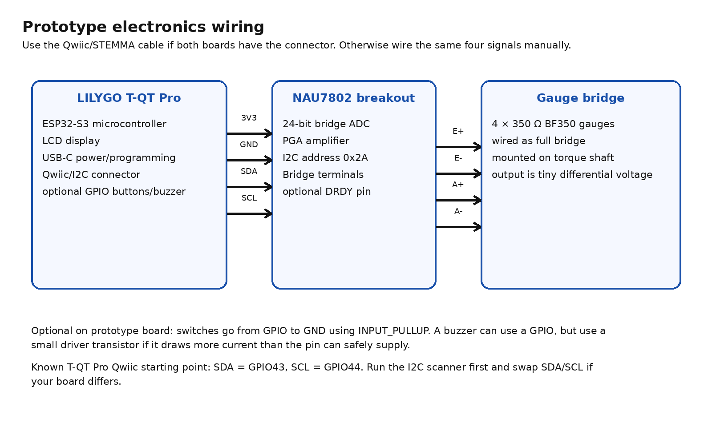
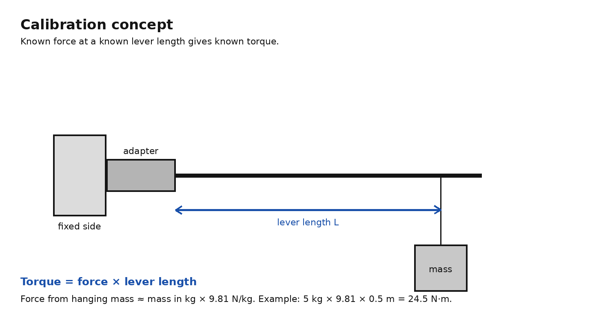
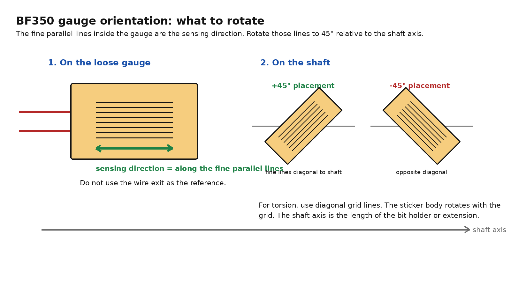
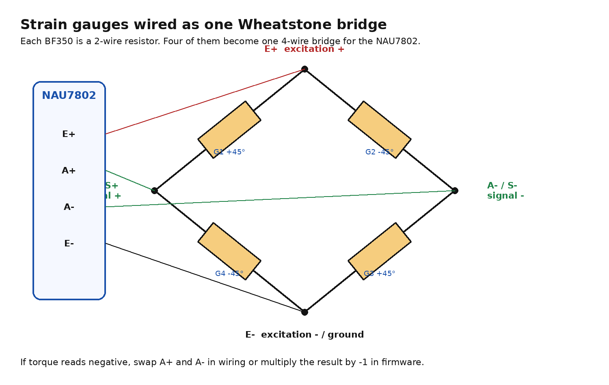
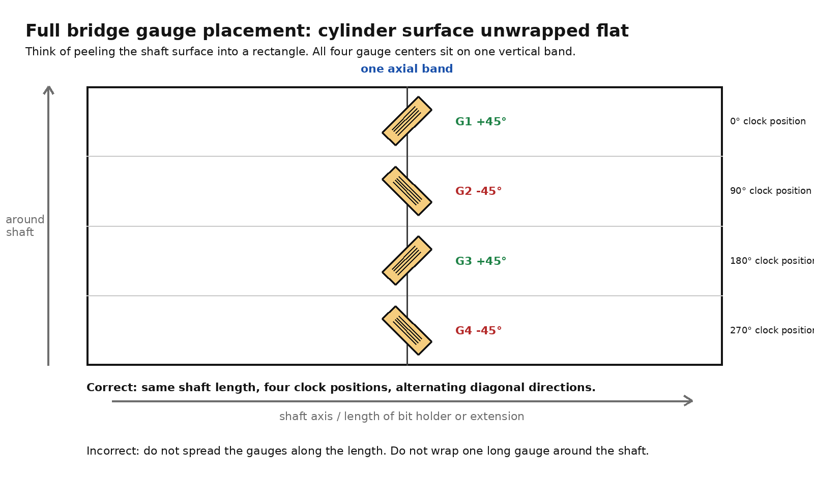
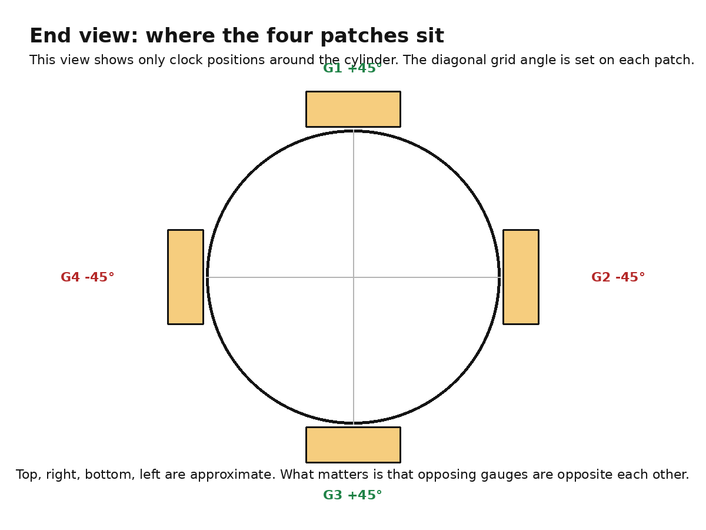

# Compact 1/4 inch hex torque adapter project report

## Status snapshot

This project is a small digital torque adapter for 1/4 inch hex bits. The adapter sits between any driver and the bit. It measures torque at the adapter instead of depending on the driver.

The intended first target is:

| Item | Current target |
|---|---:|
| Useful calibrated range | 4 to 30 N·m |
| Display range | 0 to 35 N·m |
| First mechanical format | 1/4 inch hex bit holder or extension |
| Accuracy goal | Close enough for repeatable workshop use, not a calibrated industrial instrument |
| Battery | Deferred for first prototype |

Current selected electronics:

| Part | Status | Role |
|---|---|---|
| LILYGO T-QT Pro | Ordered | Small ESP32-S3 microcontroller board with screen and USB-C |
| NAU7802 breakout | Ordered | Strain gauge amplifier and ADC |
| Prototype board and cables | Ordered | Temporary wiring and test fixture |
| Mechanical keyboard switches | On hand | Tare, mode, target adjust, or calibration controls |
| 1/4 inch bit holders/extensions | On hand | Candidate torque elements |

## Project motivation

Most common digital torque adapters are made around 1/2 inch square drive. They are useful for automotive-scale torque, but too large for compact 1/4 inch hex bit work. A digital torque wrench is a reasonable commercial solution, but a compact adapter is mechanically interesting because it allows the same measuring element to work with different hand drivers, electric drivers, ratchets, or fixtures.

The project is not trying to replace a certified torque instrument. The goal is a compact, repeatable, calibrated-enough torque checker/adapter.

## System architecture



The device has four main blocks:

1. **Torque element**: the steel bit holder or extension that twists slightly under load.
2. **Strain gauges**: thin foil resistors bonded to the torque element. Their resistance changes slightly when the metal stretches or compresses.
3. **NAU7802 amplifier and ADC**: an **ADC**, or analog-to-digital converter, changes a small analog voltage into numbers the software can use. The NAU7802 also includes a **PGA**, or programmable gain amplifier, which boosts the tiny bridge signal before conversion.
4. **T-QT Pro microcontroller board**: a **microcontroller**, or MCU, is the small programmable computer that reads the NAU7802, applies calibration, and updates the display.

The NAU7802 talks to the T-QT Pro over **I2C**, short for Inter-Integrated Circuit. I2C is a two-signal digital bus using **SDA** for data and **SCL** for clock. **Qwiic** and **STEMMA QT** are small four-pin connector ecosystems for I2C modules. In this project, they are convenient because the connector carries 3.3 V, ground, SDA, and SCL.

## Theory: how torque becomes a number

### Torque

Torque is rotational force. For calibration, use:

```text
Torque = force × lever length
```

For a hanging mass:

```text
Force in newtons ≈ mass in kg × 9.81
```

Example:

```text
5 kg × 9.81 N/kg × 0.5 m = 24.5 N·m
```



### Torsion and strain

When torque is applied to a shaft, the shaft twists by a very small amount. The surface of the shaft sees **strain**, which means microscopic stretching or compression.

For a round shaft in torsion, the strongest stretch/compression directions are diagonal to the shaft, roughly plus or minus 45 degrees from the shaft axis. The **shaft axis** is simply the length direction of the bit holder or extension.

A foil strain gauge measures strain along the direction of its fine parallel sensing lines. For torsion, those fine lines should be diagonal to the shaft axis.



### Wheatstone bridge

A **Wheatstone bridge** is a four-resistor circuit used to measure tiny resistance changes. Each BF350 strain gauge is a two-wire resistor. Four individual gauges can be wired into one full bridge.

The NAU7802 provides bridge **excitation**, meaning it powers the bridge through E+ and E-. The bridge returns a tiny **differential signal**, meaning the voltage difference between A+ and A-. The NAU7802 amplifies and digitizes that difference.



After calibration, the firmware converts raw ADC counts into torque:

```text
torque_Nm = scale_factor × (raw_reading - zero_offset)
```

The first prototype can use a single linear scale factor. A later version can use a calibration table if the response is not linear enough.

## Hardware selected

### LILYGO T-QT Pro

The T-QT Pro is the selected first microcontroller board. It is compact and integrates the microcontroller, display, USB-C programming/power, and basic expansion.

Relevant features:

| Feature | Why it matters |
|---|---|
| ESP32-S3 | Programmable MCU with enough performance for display and sensor reading |
| 0.85 inch color LCD | Enough display area for live torque, peak, and target |
| USB-C | Power and programming for the first prototype |
| Qwiic/STEMMA-style I2C connector | Simple connection to the NAU7802 breakout |
| User buttons | Useful later, but not essential because external switches can be added |
| Battery support on Pro version | Useful later, deferred for now |

LILYGO documents the T-QT as an ESP32-S3 board with a 0.85 inch LCD and two programmable buttons. The LILYGO GitHub quick start also notes that Arduino ESP32 core version compatibility matters for the display stack. Use the official examples as the reference for display bringup.

Important I2C note: community and repository issue notes point to the T-QT Pro Qwiic connector using GPIO43 for SDA and GPIO44 for SCL as the practical starting point. Run the I2C scanner before assuming the wiring is correct.

### NAU7802 breakout

The NAU7802 is the selected strain gauge front end. It is a precision 24-bit ADC with an onboard low-noise PGA and an I2C-compatible two-wire digital interface. Nuvoton describes it as intended for bridge and sensor measurements such as weigh scales and strain gauges.

Relevant features:

| Feature | Meaning for this project |
|---|---|
| 24-bit ADC | High-resolution conversion of the tiny bridge voltage |
| PGA gain 1 to 128 | Lets the small strain signal be amplified before conversion |
| I2C interface | Simple two-wire digital link to the T-QT Pro |
| Fixed I2C address 0x2A | Expected address in the scanner |
| E+ and E- terminals | Power the strain gauge bridge |
| A+ and A- terminals | Read the bridge differential output |
| Optional DRDY pin | Data-ready output, not needed for first prototype |

Typical breakout wiring:

| T-QT Pro side | NAU7802 side | Purpose |
|---|---|---|
| 3V3 | VIN | Power for NAU7802 board |
| GND | GND | Common ground |
| GPIO43 or SDA | SDA | I2C data |
| GPIO44 or SCL | SCL | I2C clock |
| not required initially | DRDY | Optional data-ready signal |

Bridge wiring:

| NAU7802 terminal | Bridge node |
|---|---|
| E+ | Excitation positive |
| E- | Excitation negative / ground |
| A+ | Signal positive |
| A- | Signal negative |

Some NAU7802 breakouts have Qwiic/STEMMA QT connectors. Some also expose B+ and B- for the second NAU7802 input channel. Use A+ and A- first.

## Buttons, buzzer, and battery

For the first prototype, keep these as optional add-ons.

### Buttons

A **GPIO**, or general-purpose input/output pin, is a microcontroller pin that firmware can read or control. For a simple external button, wire one side of the switch to a free GPIO and the other side to ground. In firmware, use `INPUT_PULLUP`, which means the pin normally reads high and reads low when the switch is pressed.

First useful controls:

| Function | Minimal behavior |
|---|---|
| Tare | Capture current raw reading as zero |
| Mode | Later: live, peak, target, calibration |
| Up/down | Later: change target torque |

### Buzzer

A buzzer is useful because it removes the need to stare at the display while tightening. For first testing, leave it off unless the live reading already works. If the buzzer draws more current than a GPIO pin can safely supply, drive it through a small transistor instead of directly from the pin.

### Battery

Battery operation is deferred. The first prototype should run from USB-C. The T-QT Pro Pro-version battery charging support can be revisited after the sensor and calibration path work.

## Quick start: software

### Software needed

Use the Arduino IDE first. The **Arduino IDE** is a desktop app that compiles and uploads small C++ programs, called sketches, to boards such as the ESP32.

Install:

| Software/library | Purpose |
|---|---|
| Arduino IDE | Compile and upload sketches |
| ESP32 board package | Adds ESP32-S3 support to Arduino IDE |
| Adafruit NAU7802 library | Reads the NAU7802 from Arduino code |
| TFT_eSPI library | Drives the T-QT Pro display when configured for the board |
| LILYGO T-QT examples/config | Reference display setup for this board |

Use LILYGO's repository examples to verify the display first. Then run the scanner below to verify NAU7802 communication.

### Step 1: I2C scanner

Expected result: the NAU7802 appears at address `0x2A`.

File:

```text
tqtpro_i2c_scanner.ino
```

```cpp
#include <Wire.h>

constexpr int I2C_SDA = 43;
constexpr int I2C_SCL = 44;

void setup() {
  Serial.begin(115200);
  delay(1000);
  Wire.begin(I2C_SDA, I2C_SCL);
  Serial.println("I2C scanner started");
  Serial.println("Expected NAU7802 address: 0x2A");
}

void loop() {
  int found = 0;

  for (uint8_t address = 1; address < 127; address++) {
    Wire.beginTransmission(address);
    uint8_t error = Wire.endTransmission();

    if (error == 0) {
      Serial.print("Found I2C device at 0x");
      if (address < 16) Serial.print("0");
      Serial.println(address, HEX);
      found++;
    }
  }

  if (found == 0) Serial.println("No I2C devices found");
  Serial.println("---");
  delay(2000);
}
```

### Step 2: basic read and display sketch

File:

```text
torque_adapter_basic_serial_and_display.ino
```

This sketch reads raw NAU7802 counts, subtracts a tare offset, applies a placeholder scale, prints to serial, and displays torque on the T-QT Pro screen. The display part assumes TFT_eSPI is configured for the T-QT Pro using the LILYGO examples.

The placeholder `countsPerNm` must be replaced after calibration.

```cpp
#include <Wire.h>
#include <Adafruit_NAU7802.h>
#include <TFT_eSPI.h>

constexpr int I2C_SDA = 43;
constexpr int I2C_SCL = 44;
constexpr int TARE_PIN = 14;

float countsPerNm = 10000.0f;
float targetNm = 10.0f;

Adafruit_NAU7802 nau;
TFT_eSPI tft = TFT_eSPI();

int32_t zeroOffset = 0;
float peakNm = 0.0f;

int32_t readAverage(uint8_t samples) {
  int64_t sum = 0;
  for (uint8_t i = 0; i < samples; i++) {
    while (!nau.available()) delay(1);
    sum += nau.read();
  }
  return (int32_t)(sum / samples);
}

void tareNow() {
  zeroOffset = readAverage(16);
  peakNm = 0.0f;
}

void setup() {
  Serial.begin(115200);
  delay(1000);

  pinMode(TARE_PIN, INPUT_PULLUP);
  tft.init();
  tft.setRotation(0);
  tft.fillScreen(TFT_BLACK);

  Wire.begin(I2C_SDA, I2C_SCL);

  if (!nau.begin()) {
    Serial.println("NAU7802 not found");
    while (true) delay(10);
  }

  nau.setLDO(NAU7802_3V0);
  nau.setGain(NAU7802_GAIN_128);
  nau.setRate(NAU7802_RATE_80SPS);

  for (uint8_t i = 0; i < 10; i++) {
    while (!nau.available()) delay(1);
    nau.read();
  }

  while (!nau.calibrate(NAU7802_CALMOD_INTERNAL)) delay(500);
  while (!nau.calibrate(NAU7802_CALMOD_OFFSET)) delay(500);

  tareNow();
}

void loop() {
  static uint32_t lastDrawMs = 0;
  static bool lastTareState = HIGH;

  bool tareState = digitalRead(TARE_PIN);
  if (lastTareState == HIGH && tareState == LOW) tareNow();
  lastTareState = tareState;

  int32_t raw = readAverage(4);
  float torqueNm = (raw - zeroOffset) / countsPerNm;
  if (torqueNm > peakNm) peakNm = torqueNm;

  Serial.print("raw=");
  Serial.print(raw);
  Serial.print(" torque_Nm=");
  Serial.println(torqueNm, 3);

  if (millis() - lastDrawMs > 150) {
    tft.fillScreen(TFT_BLACK);
    tft.setTextColor(TFT_WHITE, TFT_BLACK);
    tft.setTextSize(2);
    tft.setCursor(6, 8);
    tft.print(torqueNm, 1);
    tft.print(" Nm");

    tft.setTextSize(1);
    tft.setCursor(6, 45);
    tft.print("Peak ");
    tft.print(peakNm, 1);
    tft.setCursor(6, 62);
    tft.print("Target ");
    tft.print(targetNm, 1);

    lastDrawMs = millis();
  }
}
```

## Assembly plan

### Shaft choice

For 4 to 30 N·m, start with the best 1/4 inch hex bit holder or extension you already have. Pick the candidate with:

| Feature | Reason |
|---|---|
| Smooth cylindrical or mostly smooth section | Easier gauge placement |
| Enough straight length for one gauge band | All gauges should be centered at the same shaft station |
| No groove or moving sleeve at the gauge band | Avoid bad strain readings |
| Good steel tool construction | Better elastic behavior |
| Not excessively thick | More measurable strain at 4 N·m |

30 N·m is high for some 1/4 inch hex tooling. The weak link may become the bit, bit holder, adapter, or driver before the gauge electronics.

### Surface prep

The gauges must be bonded to bare, clean metal. Do not bond to chrome if avoidable. Remove the plating only at the gauge pads, clean the surface, then bond the gauge. The goal is not cosmetic. The goal is strain transfer from steel into the foil gauge.

### Gauge selection

The BF350-3AA-150L style gauge is usable for first testing if it physically fits the shaft. It is 350 ohm, pre-wired, and available cheaply. A smaller 350 ohm pre-wired foil gauge would be preferable if the bit holder diameter is small.

For a full bridge, buy individual two-wire gauges:

```text
4 × two-wire 350 Ω gauges = one full bridge
```

Do not buy a prebuilt four-wire load cell as the final sensor. A four-wire load cell is already a complete bridge built onto its own mechanical element. This project needs the gauges bonded directly to the bit holder or extension.

## Sensor placement made simple

Use only these two pictures for placement. Ignore the earlier generated 3D views.

### Step 1: identify the gauge direction

On the BF350, look at the fine parallel lines inside the rectangular active area. Those lines are the sensing direction.


### Step 2: place four separate patches around one shaft band

Choose one narrow band around the shaft. All four gauge centers go on that same band, not spread along the length.



End view:



Placement rule:

| Gauge | Clock position around shaft | Fine-line direction |
|---|---:|---:|
| G1 | 0 degrees, top | +45 degrees |
| G2 | 90 degrees, right | -45 degrees |
| G3 | 180 degrees, bottom | +45 degrees |
| G4 | 270 degrees, left | -45 degrees |

The 90 degree spacing is where the patches sit around the cylinder. The plus/minus 45 degree angle is how the fine parallel sensing lines are rotated relative to the shaft axis.

If the reading goes negative under tightening torque, do not rebuild the sensor. Swap A+ and A- or invert the sign in firmware.

## Prototyping on the testing board

First test the electronics without bonded gauges.

### Dummy bridge test

Use four matched 350 ohm resistors as a dummy Wheatstone bridge. This only proves that the electronics chain works. It does not simulate torque.

Expected result:

```text
T-QT Pro powers up
I2C scanner finds 0x2A
NAU7802 raw reading is stable enough to tare
Display updates
```

### Then bonded gauge test

After the dummy bridge works:

1. Bond four gauges to one shaft band.
2. Wire them into the full bridge shown above.
3. Connect E+, E-, A+, and A- to the NAU7802.
4. Tare with no torque applied.
5. Apply torque in one direction and confirm raw readings move consistently.
6. Reverse torque direction and confirm the sign reverses.

## Calibration plan

Use the torque wrench or lever/weight setup. The first calibration can be linear.

Suggested points:

```text
0 N·m
4 N·m
8 N·m
15 N·m
22 N·m
30 N·m
```

Record raw readings going up and then back down. If the readings do not return close to zero after unloading, the problem is likely mechanical hysteresis, poor bond, wire strain, or overload.

First scale calculation:

```text
countsPerNm = (raw_at_known_torque - raw_zero) / known_torque_Nm
```

Then firmware conversion:

```text
torque_Nm = (raw - zeroOffset) / countsPerNm
```

## Next steps

1. Receive T-QT Pro and NAU7802.
2. Verify T-QT Pro programming and display using LILYGO examples.
3. Run `tqtpro_i2c_scanner.ino` and confirm NAU7802 at `0x2A`.
4. Test NAU7802 with a four-resistor dummy bridge.
5. Select the 1/4 inch hex holder/extension with the cleanest gauge band.
6. Confirm gauge physical fit before bonding.
7. Bond four gauges, wire full bridge, and test raw response.
8. Calibrate at 4 to 30 N·m.
9. Add buttons, buzzer, and battery only after the sensor readings are repeatable.

## Open decisions

| Decision | Current leaning |
|---|---|
| Exact strain gauge model | 350 ohm pre-wired BF350-type, smaller if possible |
| Shaft/holder choice | Best smooth 1/4 inch hex extension on hand |
| UI controls | External switches first, onboard buttons later |
| Battery | USB-C only for prototype, battery later |
| Final package | Not decided until sensor geometry is proven |

## Sources

- LILYGO T-QT GitHub repository: https://github.com/Xinyuan-LilyGO/T-QT
- LILYGO T-QT Pro product page: https://lilygo.cc/en-us/products/t-qt-pro
- T-QT Pro I2C pin discussion, GPIO43 SDA and GPIO44 SCL: https://github.com/Xinyuan-LilyGO/T-QT/issues/26
- T-QT Pro Qwiic silkscreen/pinout discussion: https://github.com/Xinyuan-LilyGO/T-QT/issues/17
- Nuvoton NAU7802 datasheet Rev 2.6: https://www.nuvoton.com/export/resource-files/en-us--DS_NAU7802_DataSheet_EN_Rev2.6.pdf
- Adafruit NAU7802 guide: https://cdn-learn.adafruit.com/downloads/pdf/adafruit-nau7802-24-bit-adc-stemma-qt-qwiic.pdf
- SparkFun Qwiic Scale NAU7802 Arduino library: https://github.com/sparkfun/SparkFun_Qwiic_Scale_NAU7802_Arduino_Library

